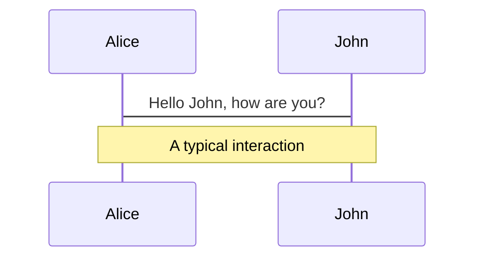
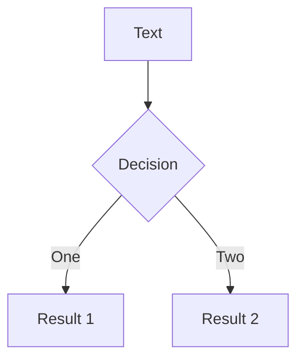
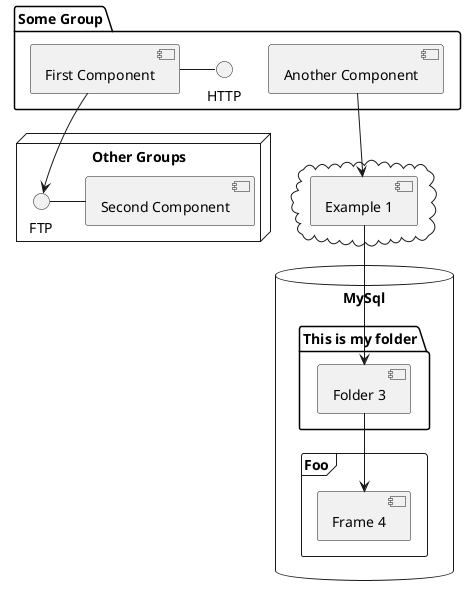

---
# try also 'default' to start simple
theme: default
# random image from a curated Unsplash collection by Anthony
# like them? see https://unsplash.com/collections/94734566/slidev
background: https://source.unsplash.com/collection/94734566/1920x1080
# apply any windi css classes to the current slide
class: 'text-center'
# https://sli.dev/custom/highlighters.html
highlighter: shiki
# show line numbers in code blocks
lineNumbers: true
# some information about the slides, markdown enabled
info: |
  ## How to draw an owl
  Presentation about transitions and tweening is js

# persist drawings in exports and build
drawings:
  persist: false
---

# How to draw an owl

---
layout: center
---


---
layout: image-right
image: https://www.triplejack.com/profiles/1146618-d1d0b060e4aacdb4b0fcf4cd4cd30105.jpg
---

# Animation naïve 
## Translation 2D avec setInterval()


<div v-click class="text-4xl text-center">

$$ d = v \cdot t $$


  <div class="text-lg italic text-center">
  avec vitesse fixe, durée fixe
  </div>
</div>


---
layout: iframe-left
url: http://localhost:5000/#naive
---

```ts
let x = 10;
$: cleanX = Math.round(x);

const smoothMove = 
        (step: number, duration = 1) => {
  const start = window.performance.now();
  const loopID = setInterval(() => {
        const now = window.performance.now();
        if (now > start + duration * 1000) {
            clearInterval(loopID);
        }
        x += step;
    }, 1000 / 60  // 60 fps
  );
}
```

```html
<div class="container">
  <button on:click={() => smoothMove(.25)}>
    Click me
  </button>
  <div class="circle" style="left:{x}%">
      <span class="text">{cleanX}%</span>
  </div>
</div>
```


---
layout: image-right
image: https://www.allaboutbirds.org/guide/assets/photo/297342421-480px.jpg
---

# Tweening _(ou interpolation)_


<div class="text-4xl text-center">

$$ A \to B $$


  <div class="text-lg italic text-center">
  distance fixe, durée fixe <br/>
  vitesse variable
  </div>
</div>


---
layout: image-right
image: https://www.seekpng.com/png/detail/949-9494500_administration-owl-teacher-cartoon.png
---

# Tweening avec setInterval()

- Arguments : position d'origine x<sub>A</sub>, position cible x<sub>B</sub>, durée D
- Normalisation du temps (t ∈ [0, 1])

$$
\begin{aligned}
t & = t_{écoulé} / D \\
tween(t) & = x_A + t \cdot (x_B - x_A) \\
tween(0) & = x_A \\
tween(1) & = x_B \\
\end{aligned}
$$


---
layout: iframe-left
url: http://localhost:5000/#naive-tween
---

```ts
export let x = 10;

const tween = 
    (targetPos: number, duration: number) => {
  const startPos = x;
  const start = window.performance.now();
  const dist = (t) => 
    startPos + t * (targetPos - startPos);

  const loopID = setInterval(() => {
    const elapsed = 
        window.performance.now() - start;
    if (elapsed > duration) {
      clearInterval(loopID);
    } else {
      x = dist(elapsed / duration);
    }
  }, 1000 / 60  // 60 fps
  );
}
$: tween(target, duration);
```

```html
<div class="circle" style="left:{x}%">
  <span class="text">{cleanX}%</span>
</div>
```

---
layout: image-right
image: https://cdn2.vectorstock.com/i/1000x1000/72/41/cute-owl-in-a-pilot-hat-vector-20437241.jpg
---

# RAF
```js
 window.requestAnimationFrame(callback);
```

- ☎️ Le browser appelera `callback` le prochain repaint
- ℹ️ `callback(ts)` avec ts, timestamp en ms
- ⏱ Permet de synchroniser et d'optimiser toutes les animations
- ✋ Mis en pause si l'onglet n'est pas visible


---
layout: image-left
image: https://images.kernelshirt.com/2021/07/Thats-what-I-do-I-fly-and-I-know-things-Owl-Pilot-poster.jpg
---

# Utilisation

```ts
const start = window.performance.now();

const animate = (ts: number) => {
  const t = (ts - start) / duration;
  if (t >= 1) {
    // Condition de sortie
  } else {
    // Animation avec t et appel récursif
    window.requestAnimationFrame(animate);
  }
};
window.requestAnimationFrame(animate);
```

---
layout: two-cols
---

<template v-slot:default>

## Code précédent 

```ts{monaco}
export let x = 10;

const tween = 
    (targetPos: number, duration: number) => {
  const startPos = x;
  const start = window.performance.now();
  const dist = (t) => 
    startPos + t * (targetPos - startPos);

  const loopID = setInterval(() => {
    const elapsed = 
        window.performance.now() - start;
    if (elapsed > duration) {
      clearInterval(loopID);
    } else {
      x = dist(elapsed / duration);
    }
  }, 1000 / 60  // 60 fps
  );
}
$: tween(target, duration);
```
</template>

<template v-slot:right>

## RAF

```ts{monaco}
const start = window.performance.now();

const animate = (ts: number) => {
  const t = (ts - start) / duration;
  if (t >= 1) {
    // Condition de sortie
  } else {
    // Animation avec t et appel récursif
    window.requestAnimationFrame(animate);
  }
};
window.requestAnimationFrame(animate);
```
</template>

---
layout: iframe-left
url: http://localhost:5000/#raf-tween
---

```ts
const tween = 
  (targetPos: number, duration: number) => {
  
  const startPos = x;
  const start = window.performance.now();
  const dist = (t) => 
          startPos + t * (targetPos - startPos);

  const animate = (ts: number) => {
    const t = (ts - start) / duration;
    if (t >= 1) {
      x = targetPos;
    } else {
      x = dist(t);
      window.requestAnimationFrame(animate);
    }
  };
  window.requestAnimationFrame(animate);
};
$:tween(target, duration);
```

---
layout: center
---
# Utilitaire avec un store Svelte
Store Svelte

```js
// Init
const store = writable(0);
// MAJ
store.set(100);
store.update( n => n + 1)
// Abonnement et désabonnement
const unsubscribe = store.subscribe( value => console.log(value) );
unsubscribe();

// Auto-abonnement/désabonnement
$store
```

Un peu comme `useContext()` en React ou `BehaviorSubject` en Angular/RxJs

---
layout: iframe-left
url: http://localhost:5000/#svelte-tween
class: code-sm
---

```ts
export function tween(init: number) {
  const store = writable(init);
  let newPos = init;
  function set(targetPos: number, 
               duration: number): void {
    const startPos = newPos;
    const start = window.performance.now();
    const dist = (t) => 
            startPos + t * (targetPos - startPos);

    const animate = (ts: number) => {
      const t = (ts - start) / duration;
      if (t >= 1) {
        newPos = targetPos;
        store.set(newPos);
      } else {
        newPos = dist(t);
        store.set(newPos);
        window.requestAnimationFrame(animate);
      }};
    window.requestAnimationFrame(animate);
  }
  return { set, subscribe: store.subscribe,};
}

const x = tween(init);
$: x.set(target, duration);
```

```html
 <div class="circle" style="transform: translateX({$x/100 * width}px);">
    <span class="text">{Math.round($x)}%</span>
  </div>
```

---

# What is Slidev?

Slidev is a slides maker and presenter designed for developers, consist of the following features

- 📝 **Text-based** - focus on the content with Markdown, and then style them later
- 🎨 **Themable** - theme can be shared and used with npm packages
- 🧑‍💻 **Developer Friendly** - code highlighting, live coding with autocompletion
- 🤹 **Interactive** - embedding Vue components to enhance your expressions
- 🎥 **Recording** - built-in recording and camera view
- 📤 **Portable** - export into PDF, PNGs, or even a hostable SPA
- 🛠 **Hackable** - anything possible on a webpage

<br>
<br>

Read more about [Why Slidev?](https://sli.dev/guide/why)

<!--
You can have `style` tag in markdown to override the style for the current page.
Learn more: https://sli.dev/guide/syntax#embedded-styles
-->

<style>
h1 {
  background-color: #2B90B6;
  background-image: linear-gradient(45deg, #4EC5D4 10%, #146b8c 20%);
  background-size: 100%;
  -webkit-background-clip: text;
  -moz-background-clip: text;
  -webkit-text-fill-color: transparent;
  -moz-text-fill-color: transparent;
}
</style>

---

# Navigation

Hover on the bottom-left corner to see the navigation's controls panel, [learn more](https://sli.dev/guide/navigation.html)

### Keyboard Shortcuts

|     |     |
| --- | --- |
| <kbd>right</kbd> / <kbd>space</kbd>| next animation or slide |
| <kbd>left</kbd>  / <kbd>shift</kbd><kbd>space</kbd> | previous animation or slide |
| <kbd>up</kbd> | previous slide |
| <kbd>down</kbd> | next slide |

<!-- https://sli.dev/guide/animations.html#click-animations -->

<p v-after class="absolute bottom-23 left-45 opacity-30 transform -rotate-10">Here!</p>

---
layout: image-right
image: https://source.unsplash.com/collection/94734566/1920x1080
---

# Code

Use code snippets and get the highlighting directly![^1]

```ts {all|2|1-6|9|all}
interface User {
  id: number
  firstName: string
  lastName: string
  role: string
}

function updateUser(id: number, update: User) {
  const user = getUser(id)
  const newUser = {...user, ...update}  
  saveUser(id, newUser)
}
```

<arrow v-click="3" x1="400" y1="420" x2="230" y2="330" color="#564" width="3" arrowSize="1" />

[^1]: [Learn More](https://sli.dev/guide/syntax.html#line-highlighting)

<style>
.footnotes-sep {
  @apply mt-20 opacity-10;
}
.footnotes {
  @apply text-sm opacity-75;
}
.footnote-backref {
  display: none;
}
</style>

---

# Components

<div grid="~ cols-2 gap-4">
<div>

You can use Vue components directly inside your slides.

We have provided a few built-in components like `<Tweet/>` and `<Youtube/>` that you can use directly. And adding your custom components is also super easy.

```html
<Counter :count="10" />
```

<!-- ./components/Counter.vue -->
<Counter :count="10" m="t-4" />

Check out [the guides](https://sli.dev/builtin/components.html) for more.

</div>
<div>

```html
<Tweet id="1390115482657726468" />
```

<Tweet id="1390115482657726468" scale="0.65" />

</div>
</div>


---
class: px-20
---

# Themes

Slidev comes with powerful theming support. Themes can provide styles, layouts, components, or even configurations for tools. Switching between themes by just **one edit** in your frontmatter:

<div grid="~ cols-2 gap-2" m="-t-2">

```yaml
---
theme: default
---
```

```yaml
---
theme: seriph
---
```


</div>

Read more about [How to use a theme](https://sli.dev/themes/use.html) and
check out the [Awesome Themes Gallery](https://sli.dev/themes/gallery.html).

---
preload: false
---

# Animations

Animations are powered by [@vueuse/motion](https://motion.vueuse.org/).

```html
<div
  v-motion
  :initial="{ x: -80 }"
  :enter="{ x: 0 }">
  Slidev
</div>
```

<div class="w-60 relative mt-6">
  <div class="relative w-40 h-40">
    
    
    
  </div>

  <div
    class="text-5xl absolute top-14 left-40 text-[#2B90B6] -z-1"
    v-motion
    :initial="{ x: -80, opacity: 0}"
    :enter="{ x: 0, opacity: 1, transition: { delay: 2000, duration: 1000 } }">
    Slidev
  </div>
</div>

<!-- vue script setup scripts can be directly used in markdown, and will only affects current page -->
<script setup lang="ts">
const final = {
  x: 0,
  y: 0,
  rotate: 0,
  scale: 1,
  transition: {
    type: 'spring',
    damping: 10,
    stiffness: 20,
    mass: 2
  }
}
</script>

<div
  v-motion
  :initial="{ x:35, y: 40, opacity: 0}"
  :enter="{ y: 0, opacity: 1, transition: { delay: 3500 } }">

[Learn More](https://sli.dev/guide/animations.html#motion)

</div>

---

# LaTeX

LaTeX is supported out-of-box powered by [KaTeX](https://katex.org/).

<br>

Inline $\sqrt{3x-1}+(1+x)^2$

Block
$$
\begin{array}{c}

\nabla \times \vec{\mathbf{B}} -\, \frac1c\, \frac{\partial\vec{\mathbf{E}}}{\partial t} &
= \frac{4\pi}{c}\vec{\mathbf{j}}    \nabla \cdot \vec{\mathbf{E}} & = 4 \pi \rho \\

\nabla \times \vec{\mathbf{E}}\, +\, \frac1c\, \frac{\partial\vec{\mathbf{B}}}{\partial t} & = \vec{\mathbf{0}} \\

\nabla \cdot \vec{\mathbf{B}} & = 0

\end{array}
$$

<br>

[Learn more](https://sli.dev/guide/syntax#latex)

---

# Diagrams

You can create diagrams / graphs from textual descriptions, directly in your Markdown.

<div class="grid grid-cols-3 gap-10 pt-4 -mb-6">







</div>

[Learn More](https://sli.dev/guide/syntax.html#diagrams)


---
layout: center
class: text-center
---

# Learn More

[Documentations](https://sli.dev) · [GitHub](https://github.com/slidevjs/slidev) · [Showcases](https://sli.dev/showcases.html)
